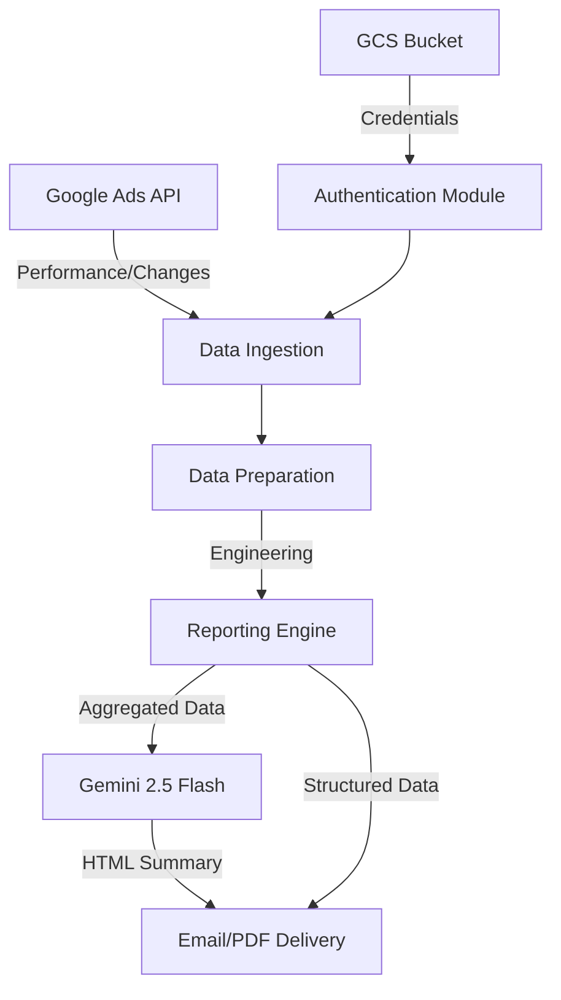

# Knowledge Transfer (KT) for `performace_report_updated.py`

## Purpose
This script automates the generation of weekly performance reports for Google Ads campaigns. It compares data from the current week against previous weeks to provide insights into trends, fluctuations, and the impact of account changes.

## Key Workflow
1.  **Authentication & Setup**: 
    - Downloads credentials from Google Cloud Storage.
    - Initializes clients for Google Ads API, Google Sheets, and Google Generative AI (Gemini).
2.  **Data Ingestion**:
    - Queries Google Ads for metrics: Impressions, Clicks, Cost.
    - Queries for conversion actions: Installs, Registrations, and FTUs (First Time Usage).
    - Fetches account change history to correlate performance shifts with specific actions.
3.  **Data Processing & Engineering**:
    - Cleans and formats raw data.
    - Extracts granular features like City, Service type, and Campaign type from naming conventions.
    - Calculates Week-over-Week (WoW) deltas for all key metrics.
4.  **Reporting Engine**:
    - Aggregates performance at PAN-India, Network (Search, Display, etc.), and City levels.
    - Identifies "Movers": Cities or Ad Groups with the most significant performance changes.
5.  **AI Analysis (Gemini)**:
    - Synthesizes the aggregated data into a professional HTML summary.
    - Analyzes the "Impact" of recent changes on performance metrics.
6.  **Delivery**:
    - Generates professional PDF reports.
    - Sends automated emails containing the HTML summary and PDF attachments to stakeholders.

## Core Dependencies
- `google-ads`: Google Ads API interaction.
- `google-generativeai`: AI-driven summary generation.
- `pandas` & `numpy`: Data manipulation and analysis.
- `fpdf2`: PDF report generation.
- `smtplib`: Email distribution.

## Configuration
- **Date Range**: Typically looks at the last 4 full weeks.
- **Targets**:
    - Install Action: `Rapido - Best Bike Taxi App (Android) First open`
    - Registration: `(AppsFlyer) Registration`
    - FTU: `platform_ride_completed-firebase_android`

---

## Technical Documentation

### 1. System Architecture

### 2. Authentication & Authorization Flow
The script employs a multi-layered authentication strategy to access various Google Cloud and Ads services:

1.  **GCS Bootstrapping**: 
    - The script uses the default environment credentials (or AI Platform service account) to initialize a `storage.Client()`.
    - it downloads a dedicated service account JSON key from a private GCS bucket (`BUCKET_NAME/BLOB_NAME`).
2.  **Local Credential Management**:
    - The downloaded JSON is saved to `/content/service_account.json`.
    - A `google-ads.yaml` configuration file is dynamically generated, embedding the path to the local JSON key.
3.  **Client Initialization**:
    - **Google Ads**: Initialized via `GoogleAdsClient.load_from_storage(local_yaml_path)`, which handles OAuth2 flow using the service account.
    - **Google Sheets (gspread)**: Uses `service_account.Credentials.from_service_account_info` with specific scopes:
        - `https://www.googleapis.com/auth/spreadsheets`
        - `https://www.googleapis.com/auth/drive.file`

### 3. Core Function Reference
| Function | Module | Description |
| :--- | :--- | :--- |
| `setup_clients` | Ingestion | Bootstraps GCS, Ads, and Sheets clients using service account keys. |
| `fetch_performance_data` | Ingestion | Executes GAQL queries for metrics and pivots by conversion action. |
| `fetch_change_history` | Ingestion | Retrieves `change_event` logs to correlate with performance shifts. |
| `prepare_data` | Processing | Performs campaign name parsing and WoW delta calculations. |
| `generate_weekly_report` | Engine | Implements city selection heuristics and generates markdown/structured data. |
| `get_ai_summary` | AI | Prompt orchestration for Gemini to generate responsive HTML emails. |

### 3. Metric Calculation Logic
The script uses `numpy` for vectorized calculations, handling division-by-zero with `where` clauses:
- **CPC**: `Cost / Clicks`
- **CPM**: `(Cost / Impressions) * 1000`
- **CTR**: `(Clicks / Impressions) * 100`
- **CPI**: `Cost / Installs`
- **CPR**: `Cost / Registrations`
- **CAC**: `Cost / FTUs`
- **WoW Delta**: `((Current - Previous) / Previous) * 100`

### 4. Campaign Name Parsing
The script utilizes a hyphen-based split strategy to extract metadata from Campaign Names:
- **City**: Index 2 (e.g., `C-D-Bangalore-...` -> `Bangalore`)
- **Service**: Index 4
- **Campaign Type**: Index 5

### 5. City Selection Heuristics (Movers)
To ensure the report remains concise yet impactful, the script uses a **Cumulative Contribution Rule**:
1.  **Selection**: Cities are sorted by their absolute change in Installs.
2.  **Coverage**: Top performers are selected until they cumulatively represent **40%** of the total change.
3.  **Filtering**: Only cities with an individual contribution **> 5%** are retained for deep-dive analysis.

### 6. AI Orchestration Strategy
The script uses **Gemini 2.5 Flash** with a structured system prompt to ensure:
- **Style Consistency**: Professional CSS styling integrated into the HTML `<head>`.
- **Trend Visualization**: Automatic color-coding (Green for positive, Red for negative).
- **Impact Analysis**: Correlating specific change events (e.g., budget shifts) with metric fluctuations.
